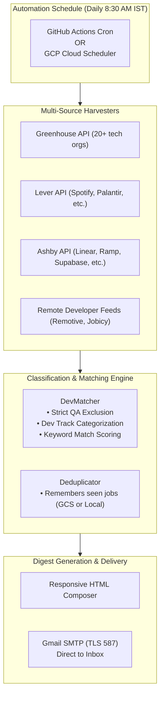

<div align="center">

# 🚀 Dev Job Hunter — Automated Daily Engineering Alerts

**Serverless, AI-friendly intelligence engine that finds high-impact Software Engineering roles with 100% direct company ATS application links.**  
*Runs for $0/month on Google Cloud Functions (Gen 2) or GitHub Actions.*

[](https://www.python.org/)
[](https://cloud.google.com/functions)
[](https://github.com/features/actions)
[](LICENSE)

</div>

---

## 🌟 Why This Exists

Most automated job search tools rely on scraping LinkedIn, Indeed, or Naukri, which leads to:
- ❌ **Frequent CAPTCHAs & Cloudflare blocks** when running on cloud IPs.
- ❌ **Stale job listings & ghost jobs** from aggregator sites.
- ❌ **Recruiter middleman portals** that steal candidate data.

### 💡 The Solution: Direct ATS Harvesters
**Dev Job Hunter** queries public REST APIs used directly by modern tech companies:
- 🏢 **Greenhouse Public Boards** (Stripe, Datadog, Cloudflare, GitLab, Elastic, Figma, Twilio, MongoDB, Reddit, etc.)
- 🏢 **Lever Public Boards** (Spotify, Palantir, Benchling, Affirm, etc.)
- 🏢 **Ashby Public Boards** (Linear, Ramp, Supabase, Perplexity, Vercel, etc.)
- 🌐 **Developer Feeds** (Remotive Dev, Jobicy Dev)

**Every link in your email digest is a 100% direct link to apply on the company's official career portal.**

---

## 🎯 Target Engineering Tracks (Zero QA / Test)

The engine filters and groups jobs into 5 focused developer tracks:

| Track | Sample Roles | Technologies & Adjacencies |
| :--- | :--- | :--- |
| 🌟 **Backend & Core Engineering** | Backend Engineer, Software Engineer, Python/Node/Java Dev | Python, TypeScript, Node.js, Java, Scala, C++, REST, GraphQL |
| ⚡ **SRE, Platform & Cloud** | Site Reliability Engineer, DevOps, Platform Engineer | Prometheus, Grafana, Docker, Kubernetes, Linux, CI/CD |
| 🔌 **API & Solutions Engineering** | Solutions Engineer, Integration Engineer, Partner Eng | REST APIs, OAuth 2.0, Webhooks, Postman, System Triage |
| 📊 **Data & Distributed Systems** | Data Engineer, Streaming Engineer, Database Engineer | PostgreSQL, MySQL, MongoDB, Apache Kafka, Complex SQL |
| 🛠️ **Developer Productivity & Tools** | DevTools Engineer, Developer Experience (DevEx) | Internal CLI, automation scripts, test infrastructure tools |

> [!NOTE]
> All QA, SDET, manual testing, recruiting, and executive roles are strictly filtered out by default.

---

## 🏗️ Architecture



---

## 🚀 Quick Start (Local Setup in 2 Minutes)

### 1. Clone & Install
```bash
git clone https://github.com/YOUR_USERNAME/daily-dev-job-alerts.git
cd daily-dev-job-alerts

# Install dependencies
pip install -r requirements.txt
```

### 2. Run a Dry Run (Generate Local HTML Preview)
```bash
python main.py --dry-run
```
*This fetches live roles, scores them against dev criteria, and creates `preview_email.html`. Open it in any browser to inspect the formatted digest!*

### 3. Run Unit Tests
```bash
python -m unittest discover -s tests
```

---

## 📧 Configuring Gmail for Daily Delivery (60 Seconds)

Because Google Cloud and GitHub Actions run headless, email is sent securely over **port 587 with TLS** using a standard Google App Password.

1. Go to your **[Google Account Security](https://myaccount.google.com/security)**.
2. Ensure **2-Step Verification** is turned **ON**.
3. Go to **[App Passwords](https://myaccount.google.com/apppasswords)**.
4. Enter `Job Alerts` as the app name and click **Create**.
5. Copy the generated **16-character code** (e.g., `abcd efgh ijkl mnop`).
6. Create a `.env` file in the project root:
   ```env
   GMAIL_USER=your.email@gmail.com
   GMAIL_APP_PASSWORD=your-16-char-app-password
   ALERT_RECIPIENT=your.email@gmail.com
   ```

### Test Email Delivery:
```bash
python main.py --test-email
```
Check your inbox! The digest will arrive in seconds.

---

## ☁️ Deployment Option 1: GitHub Actions (Easiest — Zero Cloud Setup)

You can run this daily with zero cloud configuration using GitHub Actions:

1. Push this repository to your GitHub account (public or private).
2. In your repo, go to **Settings > Secrets and variables > Actions > New repository secret**.
3. Add the following repository secrets:
   - `GMAIL_USER`: Your Gmail address
   - `GMAIL_APP_PASSWORD`: Your 16-character Gmail App Password
   - `ALERT_RECIPIENT`: Your receiving email address
4. Go to the **Actions** tab, select **Daily Dev Job Alert**, and click **Run workflow** to test it!
5. It will automatically run every morning at **03:00 UTC (8:30 AM IST)**.

---

## ☁️ Deployment Option 2: Google Cloud Function (Gen 2)

Deploy directly to Google Cloud serverless infrastructure ($0.00/month within GCP Free Tier):

### Deploy via Google Cloud Shell (In Browser)
1. Open **[Google Cloud Shell](https://shell.cloud.google.com/)**.
2. Upload this folder and run:
   ```bash
   cd daily-dev-job-alerts
   chmod +x deploy/deploy_cloud_shell.sh
   ./deploy/deploy_cloud_shell.sh
   ```
3. The script automatically:
   - Enables Cloud Functions, Cloud Build, Cloud Run, and Cloud Scheduler APIs.
   - Creates a Google Cloud Storage bucket for state deduplication.
   - Deploys the Gen 2 Cloud Function with Python 3.12.
   - Configures Cloud Scheduler to invoke the function daily at 8:30 AM IST.

---

## 🛠️ How to Customize for Your Profile

All settings are cleanly isolated in `config.py`:
- **Change Target Roles**: Edit `DEV_CATEGORIES` to add your desired roles, titles, and tech keywords.
- **Change Locations**: Edit `TARGET_LOCATIONS` to add your preferred cities or countries.
- **Add Companies**: Add any company's ATS board token to `GREENHOUSE_BOARDS`, `LEVER_COMPANIES`, or `ASHBY_ORGANIZATIONS`.
- **Change Score Threshold**: Set `MIN_MATCH_SCORE` in `.env` (default is 60).

---

## 📄 License

Distributed under the MIT License. See [LICENSE](LICENSE) for details.
